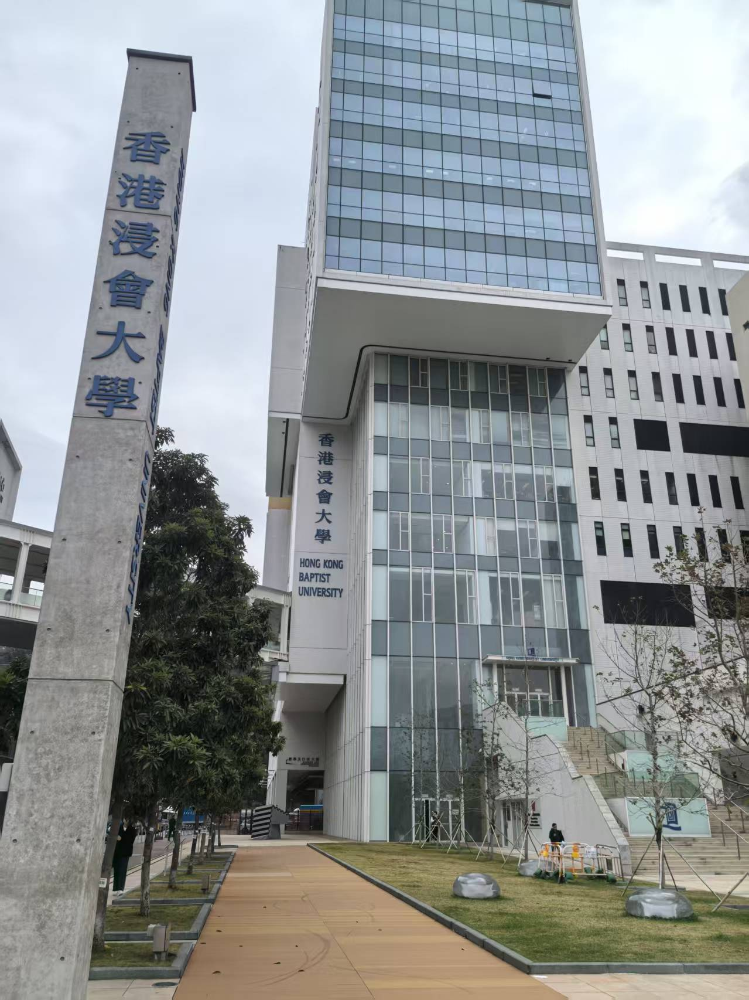
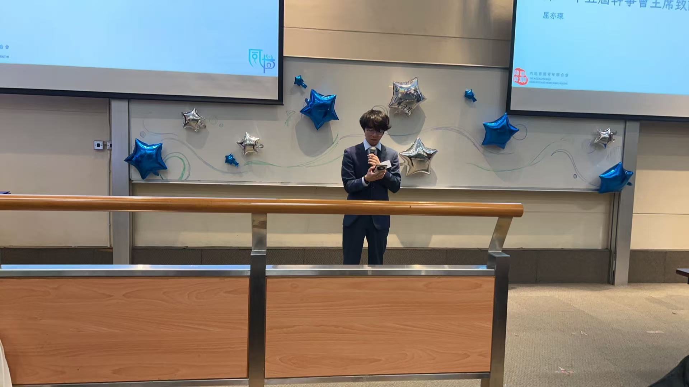
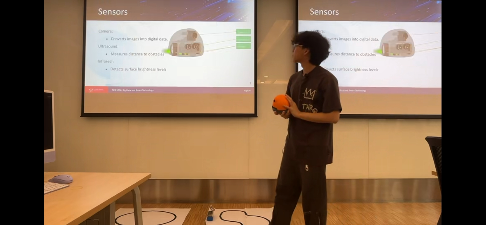
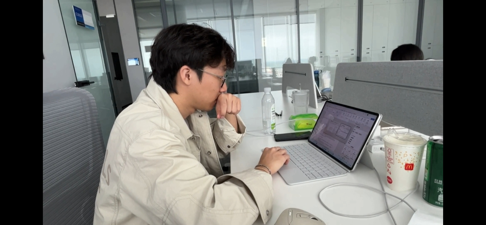

# Hi there, I'm Eason Qu (Yichen) 👋

> Business Computing & Data Analytics Student @ HKBU | Data Science & AI in Business Enthusiast

📍 Hong Kong
📧 [Email](mailto:23260068@life.hkbu.edu.hk) | 🔗 [LinkedIn](https://www.linkedin.com/in/yichen-qu-5790282aa/) | 💻 [GitHub](https://github.com/Eason-NotFound?tab=repositories)

---

## 👨‍💻 About Me

I am an undergraduate student at **Hong Kong Baptist University (HKBU)**, majoring in **Business Computing and Data Analytics** with a CGPA of **3.87/4.0**. I have also studied Computer Science as an exchange student at **Nanyang Technological University (NTU)**.

My passion lies in bridging the gap between **Data Science** and **Financial Analysis**. I specialize in applying machine learning to solve real-world business problems.

---

## 🎓 Education

### 🏛️ Hong Kong Baptist University (HKBU)
**B.Sc. in Business Computing and Data Analytics** | *2023 - Present*

* **CGPA:** 3.87 / 4.0
* **Awards:**
    * Outstanding Student Performance Award (2025)
    * HKSAR Government Scholarship (2024-2027)
    * President's Honour Roll (2023-2025)

### 🦁 Nanyang Technological University (NTU)
**Exchange Student, Mathematics and Computer Science** | *Aug 2025 - Dec 2025*

* **Focus:** AI; Data Anlytics; Computer Vision; Machine Learning

---

## 🌟 Leadership & Extracurriculars

> "Leadership is not about a title or a designation. It's about impact, influence, and inspiration."

*(Caption: Serving as the 25th President of HKBU CSSA)*

### 📢 The 25th President @ HKBU CSSA (Undergraduate Department)
*Apr 2024 – Apr 2025*

* **Team Leadership:** Led a core team of **16 members** to organize dozens of cultural and academic events throughout the year, fostering a supportive community for students.
* **Strategic Collaboration:** Collaborated with the university administration and student organizations across **eight other universities** in Hong Kong to maximize student welfare and resource sharing.
* **Community Impact:** Served a community of **nearly 1,000 members**, acting as a vital bridge to assist members in liaising with the school and resolving academic or daily life issues.
---

## 🚀 Featured Projects

### 🤖 NanoGPT-Math: DPO Fine-Tuning
*(Apr 2025 – Jun 2025)*
**[🔗 View Code on GitHub](https://github.com/Eason-NotFound/Teaching-NanoGPT-to-Do-Math)**

* **Goal:** Enhance the mathematical reasoning capabilities of large language models.
* **Details:** Fine-tuned NanoGPT using **Direct Preference Optimization (DPO)**. Improved multi-step problem solving accuracy.
* **Tech Stack:** Python, PyTorch, LLM Fine-tuning.

### 💳 Credit Default Prediction System
*(Mar 2025 – May 2025)*
**[🔗 View Code on GitHub](https://github.com/Eason-NotFound/Credit-Card-Default-Prediction)**

* **Goal:** Build robust credit risk models to predict loan defaults.
* **Details:** Implemented **XGBoost and Random Forest** algorithms with extensive feature engineering.
* **Tech Stack:** Python, Scikit-learn, XGBoost

### 📈 Global Equities Investment Analysis
*(Feb 2025 – Jun 2025)*
**[📄 Download Investment Report](docs/Investment_Report.pdf)**

* **Goal:** Conduct fundamental and technical analysis on US and Asian equities.
* **Output:** Generated comprehensive investment reports with risk-return assessments.
* **Tools:** Bloomberg Terminal, Excel

---

## 💼 Professional Experience

### 🏛️ Project Assistant @ Hong Kong Baptist University
*Jun 2025 – Aug 2025*

* **Role:** Developed educational materials for machine learning and delivered hands-on workshops.
* **Impact:** Conducted public lectures on AI applications for non-technical audiences.

### 🌐 International Project Operator @ Beijing Web3Hub
*Jul 2024 – Aug 2024*

* **Role:** Coordinated cross-border project proposals.
* **Impact:** Supported teams in refining project deliverables and managed international communication.

---

## 🛠️ Skills

* **Languages:** Python, Java, SQL, R, Power BI
* **AI/ML:** Machine Learning, XGBoost, LLM Fine-Tuning
* **Tools:** Bloomberg Terminal, Git, Excel
* **Languages:** English (IELTS 7.0), Chinese

---
*Last updated: December 2025*
