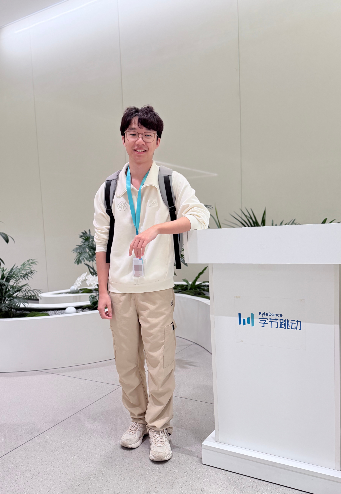

    

        <h1>Yichen (Eason) Qu</h1>
        

            <b>Business Computing and Data Analytics Undergraduate</b> 
            Hong Kong Baptist University (HKBU) 
            Business Operations & Management Intern, ByteDance
        

        

            I am a final-year undergraduate student majoring in <b>Business Computing and Data Analytics</b> at HKBU with a CGPA of <b>3.83/4.0</b>. I recently completed an exchange semester at <b>Nanyang Technological University (NTU)</b>, where I studied Artificial Intelligence, Machine Learning, and Visual & Predictive Analytics.
        

        

            I am passionate about leveraging <b>Artificial Intelligence</b>, <b>Data Science</b>, and <b>Business Analytics</b> to solve real-world business problems. My professional interests include <b>Data Science</b>, <b>Business Analytics</b>, <b>AI Product Management</b>, and <b>Machine Learning</b>, with a particular focus on building AI-powered products and data-driven decision-making solutions.
        

        

            <i class="fas fa-map-marker-alt"></i> Hong Kong &nbsp;|&nbsp;
            <i class="fas fa-envelope"></i> <a href="mailto:easonqu0719@outlook.com">Email</a> &nbsp;|&nbsp;
            <i class="fab fa-linkedin"></i> <a href="https://www.linkedin.com/in/yichen-qu-5790282aa/">LinkedIn</a> &nbsp;|&nbsp;
            <i class="fab fa-github"></i> <a href="https://github.com/Eason-NotFound">GitHub</a>
        

    

    

        
    

<h2 id="news">🔥 News</h2>

<ul class="news-list">

<li>
[May 2026]

Joined <b>ByteDance</b> as a Business Operations & Management Intern,
working on enterprise analytics, AI Agents, financial forecasting,
and business intelligence automation.

</li>

<li>
[Dec 2025]

Completed an exchange semester at
<b>Nanyang Technological University (NTU)</b>,
focusing on Artificial Intelligence,
Machine Learning,
and Visual & Predictive Analytics.

</li>

<li>
[Nov 2025]

Completed
<b>NanoGPT-Math</b>,
an LLM fine-tuning project using
Direct Preference Optimization (DPO)
for mathematical reasoning.

</li>

<li>
[2024–2025]

Awarded the
<b>Asia-Pacific Economic Cooperation (APEC) Scholarship</b>.

</li>

<li>
[2024–2027]

Received the
<b>HKSAR Government Scholarship</b>.

</li>

<li>
[2023–2025]

Named to the
<b>President's Honour Roll</b>
for outstanding academic performance.

</li>

<li>
[Apr 2024]

Appointed as the
<b>25th President</b>
of the HKBU Chinese Students and Scholars Association (CSSA).

</li>

</ul>

<h2 id="education">🎓 Education</h2>

<b>Hong Kong Baptist University (HKBU)</b>
<i>Sep 2023 – Present</i>

<ul>
<li>B.Sc. in <b>Business Computing and Data Analytics</b></li>
<li><b>CGPA:</b> 3.83 / 4.00</li>
<li>
<b>Relevant Coursework:</b>
Machine Learning,
Data Mining,
Causal Inference,
Data Structures & Algorithms,
Data Visualization,
Linear Algebra,
Economics
</li>
<li>
<b>Honors & Scholarships:</b>
<ul>
<li>President's Honour Roll (2023–2025)</li>
<li>Outstanding Student Award</li>
<li>Asia-Pacific Economic Cooperation (APEC) Scholarship</li>
<li>HKSAR Government Scholarship</li>
</ul>
</li>
</ul>

 

<b>Nanyang Technological University (NTU)</b>
<i>Aug 2025 – Dec 2025</i>

<ul>
<li>Exchange Student, Computer Science</li>
<li>
<b>Coursework:</b>
Artificial Intelligence,
Machine Learning,
Visual & Predictive Analytics
</li>
<li>
<b>Scholarship:</b>
Albert and Mabel Chan Scholarship
</li>
</ul>

<h2 id="work-experience">💼 Work Experience</h2>

<b>Business Operations & Management Intern</b>,
ByteDance
<i>May 2026 – Present</i>

<ul>

<li>
Developed enterprise SQL pipelines and automated Power BI dashboards,
transforming Excel-based workflows into scalable analytics solutions
supporting global IT budget allocation.
</li>

<li>
Built cost allocation and forecasting models using business rules and
time-series analysis to support AI infrastructure investment and
workforce planning.
</li>

<li>
Designed an LLM-based AI Agent integrating Rule Engine,
LLM evaluation, and Human-in-the-Loop (HITL) workflows
for financial auditing, anomaly detection,
and automated reporting.
</li>

<li>
Standardized analytics methodologies and AI evaluation frameworks,
improving operational efficiency and enabling scalable
data-driven decision making across business teams.
</li>

</ul>

 

<b>Project Assistant & AlphAI Robotics Workshop Designer</b>,
Hong Kong Baptist University
<i>Jun 2025 – Aug 2025</i>

<ul>

<li>
Developed robotics demonstrations using Python,
integrating computer vision and motion control.
</li>

<li>
Designed AI educational modules covering neural networks,
machine learning, and reinforcement learning
for students from multidisciplinary backgrounds.
</li>

<li>
Optimized robot control scripts and communicated technical concepts
through public workshops and hands-on demonstrations.
</li>

</ul>

 

<b>International Project Operator</b>,
Beijing Hong Kong Web3.0 Industry Center
<i>Jul 2024 – Aug 2024</i>

<ul>

<li>
Supported cross-border startup operations,
financial budgeting,
and project coordination.
</li>

<li>
Conducted data-driven marketing analysis and operational performance
reviews to support strategic decision making.
</li>

<li>
Collaborated with international partners on project planning,
resource coordination,
and business development initiatives.
</li>

</ul>

<h2 id="leadership">🏆 Leadership Experience</h2>

<b>The 25th President</b>,
HKBU Chinese Students and Scholars Association (CSSA)
<i>Apr 2024 – Apr 2025</i>

<ul>

<li>
Led the undergraduate division of the association,
overseeing organizational planning,
team management,
and strategic development.
</li>

<li>
Coordinated cultural,
academic,
and community engagement activities
serving Chinese students and scholars at HKBU.
</li>

<li>
Managed cross-functional teams and event operations,
strengthening leadership,
communication,
and project management capabilities.
</li>

</ul>

<h2 id="projects">📝 Selected Projects</h2>

<b>NanoGPT-Math: LLM Fine-Tuning with Direct Preference Optimization</b>
<i>Aug 2025 – Nov 2025</i>

<i>
Enhancing mathematical reasoning capabilities through preference-based LLM alignment.
</i>

<ul>

<li>
Built a complete PyTorch training pipeline for
Direct Preference Optimization (DPO)
using a dataset containing over 100,000 preference pairs.
</li>

<li>
Implemented custom loss balancing strategies to improve
training stability and optimization efficiency.
</li>

<li>
Evaluated mathematical reasoning performance through
benchmark testing,
error analysis,
and model comparison.
</li>

<li>
Explored alignment techniques for improving multi-step reasoning
and mathematical problem-solving abilities.
</li>

</ul>

<a href="https://github.com/Eason-NotFound/Teaching-NanoGPT-to-Do-Math" class="btn-link">
[Code]
</a>

 

<b>Credit Risk Modeling with Machine Learning</b>
<i>Sep 2025 – Dec 2025</i>

<i>
Building predictive models for credit default risk assessment.
</i>

<ul>

<li>
Developed an end-to-end machine learning pipeline
for credit default prediction using transactional and behavioral features.
</li>

<li>
Performed feature engineering,
data preprocessing,
and model evaluation using K-fold cross-validation.
</li>

<li>
Benchmarked Logistic Regression,
LightGBM,
and XGBoost models to compare predictive performance.
</li>

<li>
Applied model interpretation techniques to identify key behavioral
risk indicators and support credit policy recommendations.
</li>

</ul>

 

<b>Health Pause App Data Analytics Project</b>

<i>
Forecasting influenza trends and supporting health product strategy through predictive analytics.
</i>

<ul>

<li>
Built predictive models using Random Forest,
XGBoost,
and Artificial Neural Networks (ANN).
</li>

<li>
Analyzed historical influenza trends and external factors
to improve forecasting accuracy.
</li>

<li>
Developed visual analytics dashboards to support product planning
and strategic decision making.
</li>

</ul>

<a href="https://github.com/Eason-NotFound/Flu-Prediction-Model" class="btn-link">
[Code]
</a>

 

<b>Global Equities Investment Analysis</b>

<i>
Fundamental and quantitative analysis of U.S. and Asian equity markets.
</i>

<ul>

<li>
Conducted company valuation,
industry research,
and macroeconomic analysis across multiple sectors.
</li>

<li>
Applied technical analysis and risk-return evaluation techniques
to assess investment opportunities.
</li>

<li>
Produced professional investment reports and portfolio recommendations.
</li>

</ul>

<a href="docs/Investment_Report.pdf" class="btn-link">
[Report PDF]
</a>

<h2 id="skills">🛠 Skills</h2>

<b>Programming Languages</b>

<ul>
<li>Python</li>
<li>SQL</li>
<li>Java</li>
<li>R</li>
</ul>

<b>Artificial Intelligence & Machine Learning</b>

<ul>
<li>PyTorch</li>
<li>Scikit-learn</li>
<li>XGBoost</li>
<li>LightGBM</li>
<li>Large Language Models (LLMs)</li>
<li>AI Agents</li>
<li>Direct Preference Optimization (DPO)</li>
<li>Neural Networks</li>
<li>Reinforcement Learning</li>
</ul>

<b>Data Analytics</b>

<ul>
<li>Feature Engineering</li>
<li>Predictive Modeling</li>
<li>Time Series Analysis</li>
<li>Power BI</li>
<li>Pandas</li>
<li>Matplotlib</li>
<li>Business Intelligence</li>
</ul>

<b>Tools</b>

<ul>
<li>Git & GitHub</li>
<li>LaTeX</li>
<li>Microsoft Office</li>
<li>Bloomberg Terminal</li>
</ul>

<b>Languages</b>

<ul>
<li>English (IELTS 7.0)</li>
<li>Mandarin Chinese (Native)</li>
</ul>

 

Last Updated: March 2026

